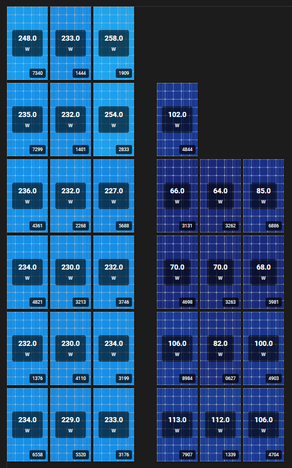
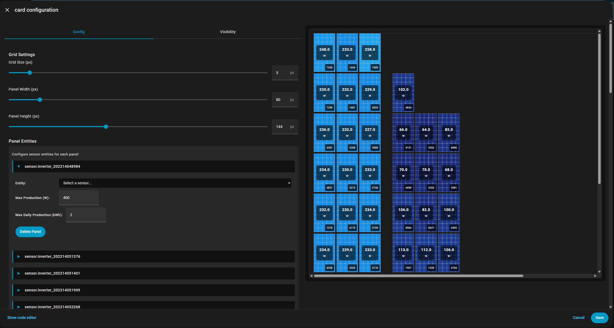

# Solar Panel Grid Lovelace Card

A custom Home Assistant Lovelace card for displaying solar panels in an interactive grid layout with real-time production data visualization. This is especially useful for users with microinverters so you can monitor every panel individually.

## Features

- **Grid Layout**: Display multiple solar panels in a flexible grid (1400×1400px workspace)
- **Drag & Drop**: Move panels freely around the canvas with smooth snapping
- **Snap-to-Grid**: Panels snap to a configurable grid for neat alignment
- **Live Data**: Real-time display of current production values from sensor entities
- **Entity Identification**: Last 4 characters of entity ID displayed at bottom-right of each panel for quick identification
- **Color Visualization**: Background color gradient indicates production level
  - Black (0%) → Dark Blue (Hue 240°) → Light Blue (Hue 180°) at 100%
  - Automatically scales based on unit type (kWh for daily energy, W for instantaneous power)
- **Full-Width Canvas**: Automatically expands card to viewport width for maximum workspace
- **Collapsible Panel UI**: Configuration panel headers collapse/expand to manage 30+ panels efficiently
- **Configuration UI**: Drag-and-drop editor with schema-driven grid settings and panel-level configurations

## Preview

### Card View


### Configuration Editor

> NOTE: It's recommended to click the titlebar of the configuration dialog so you can drag/drop panels easier.



## Installation

This card can be installed manually or through HACS (Home Assistant Community Store).

### 📦 Install with HACS
1. Add this repository to HACS as a **Plugin / Dashboard**.
2. Search for **Solar Panel Grid Card** in the HACS dashboard and install it.
3. Add the card to your dashboard using the UI editor or YAML (see configuration below).

### 🛠 Manual Installation
If you prefer not to use HACS, follow these steps:

#### Step 1: Build the Card

```bash
cd /path/to/homeassistant-solar-panels
npm install
npm run build
```

By default the build produces `dist/homeassistant-solar-panels.js`.  A copy named
`dist/homeassistant-solar-panels.js` is also created so HACS can detect the card
when the repository name doesn’t match the file name.

#### Step 2: Copy to Home Assistant

Copy the built file and image to your Home Assistant configuration:

```bash
cp dist/homeassistant-solar-panels.js /path/to/homeassistant/config/www/
cp solar-panel-frame.png /path/to/homeassistant/config/www/
```

#### Step 3: Add Resource Reference

Add the following to your Home Assistant Lovelace resources (using UI or YAML):

**UI Method:**
1. Open Home Assistant
2. Go to Settings → Dashboards → Resources
3. Click "Create Resource"
4. URL: `/local/homeassistant-solar-panels.js`
5. Resource type: `JavaScript Module`

**YAML Method:**
Add to your `ui-lovelace.yaml`:
```yaml
resources:
  - url: /local/homeassistant-solar-panels.js
    type: module
```

## Configuration

### Basic Configuration Example

Add the card to a dashboard using the UI editor:

1. Click "+ Create New Card"
2. Search for "Solar Panel Grid"
3. Configure your solar panel sensors


### YAML Configuration

```yaml
type: custom:solar-panel-grid-card
grid_size: 10              # Grid snap size in pixels (default: 10)
panel_width: 80            # Panel width in pixels (default: 80)
panel_height: 144          # Panel height in pixels (default: 144, 1:1.8 aspect ratio)
panels:
  - entity: sensor.solar_inverter_1
    x: 0
    y: 0
    max_daily_production: 5.5  # Maximum daily production in kWh
    max_production: 400        # Maximum instantaneous power in W
  - entity: sensor.solar_inverter_2
    x: 85
    y: 0
    max_daily_production: 5.5
    max_production: 400
```

### Configuration Options

#### Card-Level Options

| Option | Type | Default | Description |
|--------|------|---------|-------------|
| `type` | string | Required | `custom:solar-panel-grid-card` |
| `grid_size` | number | 10 | Snap-to-grid size in pixels |
| `panel_width` | number | 80 | Width of each panel in pixels |
| `panel_height` | number | 144 | Height of each panel in pixels (1:1.8 aspect ratio) |
| `panels` | array | Required | List of solar panel configurations |

#### Panel-Level Options

| Option | Type | Default | Description |
|--------|------|---------|-------------|
| `entity` | string | Required | Power or energy sensor entity ID (e.g., `sensor.solar_inverter_1`). Filtered selector only shows entities with `device_class: power` or `device_class: energy` |
| `x` | number | 0 | Horizontal position in pixels |
| `y` | number | 0 | Vertical position in pixels |
| `max_daily_production` | number | 5.5 | Maximum daily production in kWh (used for `kWh` and `Wh` units) |
| `max_production` | number | 400 | Maximum instantaneous power in W (used for `W` units) |

## How It Works

### Data Display

Each panel displays:
- **Background Color**: Indicates production level based on current vs. maximum value
- **Panel Image**: Visual representation of the solar panel
- **Production Value**: Current production displayed in center with unit of measurement
- **Entity ID Suffix**: Last 4 characters of entity ID at bottom-right corner for quick identification

### Color Gradient

The background color changes based on the current production value:

```
Percentage = Current Value / Max Value (based on unit_of_measurement)

0%  : #000000 (Black)
25% : #1a3a50 (Dark Blue)
50% : #2060a0 (Medium Blue)
75% : #4080d0 (Light Blue)
100%: #6ca0ff (Very Light Blue)
```

### Unit of Measurement Handling

- If sensor has `unit_of_measurement: "kWh"` → Uses `max_daily_production` for color scaling
- If sensor has `unit_of_measurement: "Wh"` → Converts `max_daily_production` (kWh) to Wh, then scales
- If sensor has `unit_of_measurement: "W"` → Uses `max_production` for color scaling
- Otherwise → Defaults to `max_production`

### Snap Behavior

Panels snap smoothly to the configured grid size while dragging. This provides clean, aligned layouts without the complexity of panel-to-panel snapping.

## Troubleshooting

### Card Not Showing

1. Check browser console for JavaScript errors (F12)
2. Verify resource path is correct: `/local/homeassistant-solar-panels.js` must exist
3. Clear browser cache and reload Home Assistant

### Data Not Updating

1. Check that sensor entities exist in Home Assistant (Developer Tools → States)
2. Verify entity IDs in card configuration match exactly
3. Check sensor has valid `state` value (not `unknown` or `unavailable`)

### Incorrect Colors

1. Verify `max_daily_production` and `max_production` values are set correctly
2. Check sensor's `unit_of_measurement` attribute in Developer Tools
3. Ensure sensor values are numeric (not strings)

## Development

### Build Commands

```bash
npm run build      # Build once
npm run dev        # Build with watch mode
npm run type-check # Run TypeScript type checking
npm run lint       # Run ESLint
```

### Project Structure

```
src/
  ├── solar-panel-grid-card.ts       # Main card component
  ├── solar-panel-grid-card-editor.ts # Configuration UI
  └── index.ts                        # Entry point
dist/
  └── homeassistant-solar-panels.js        # Built & bundled output
solar-panel-frame.png                 # Solar panel image
```

## License

MIT